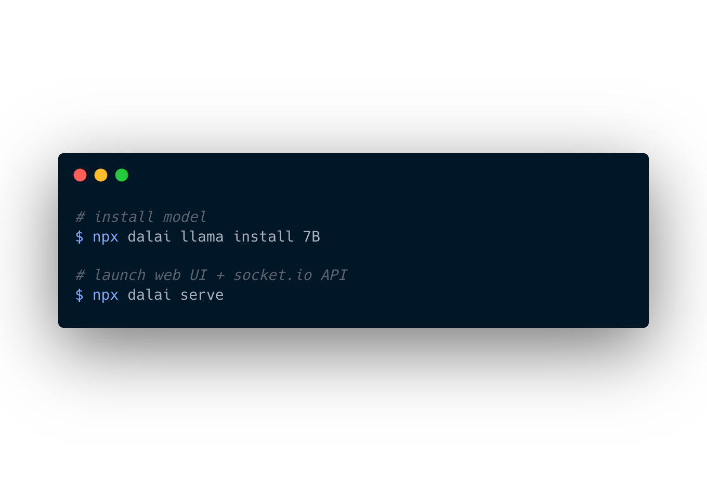
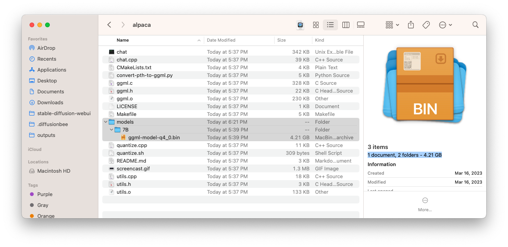
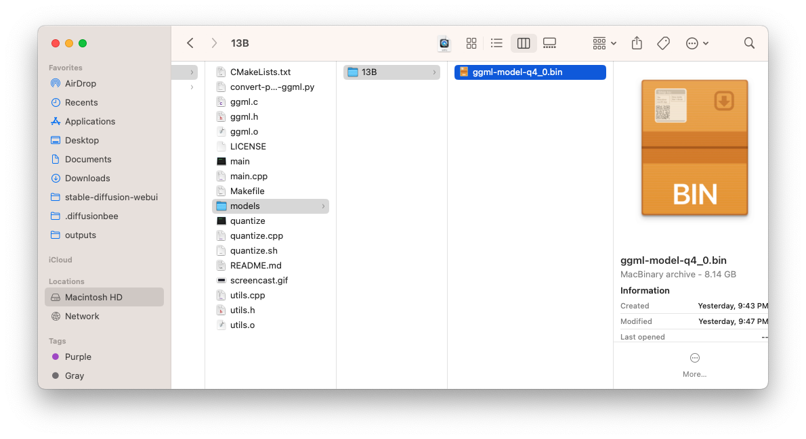
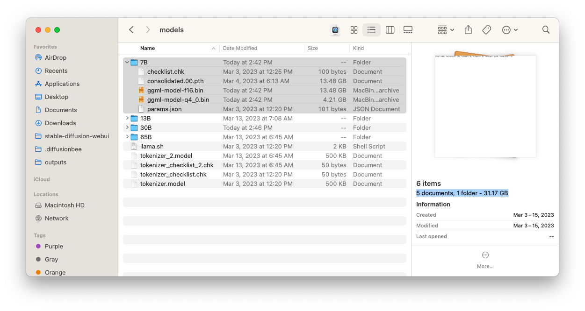
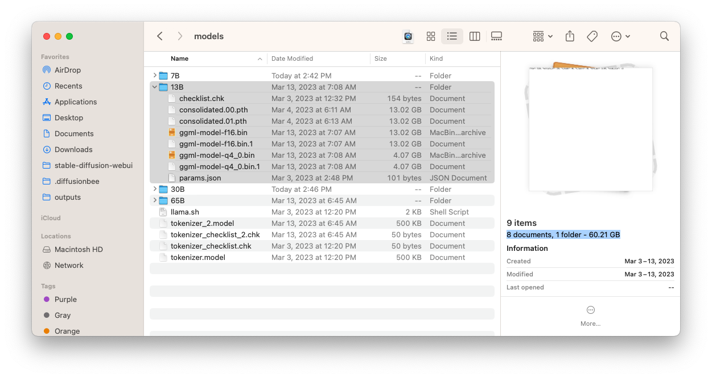
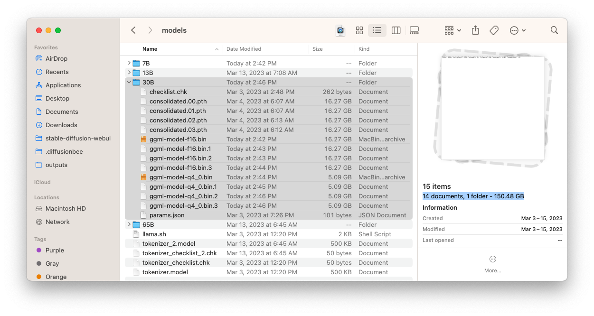
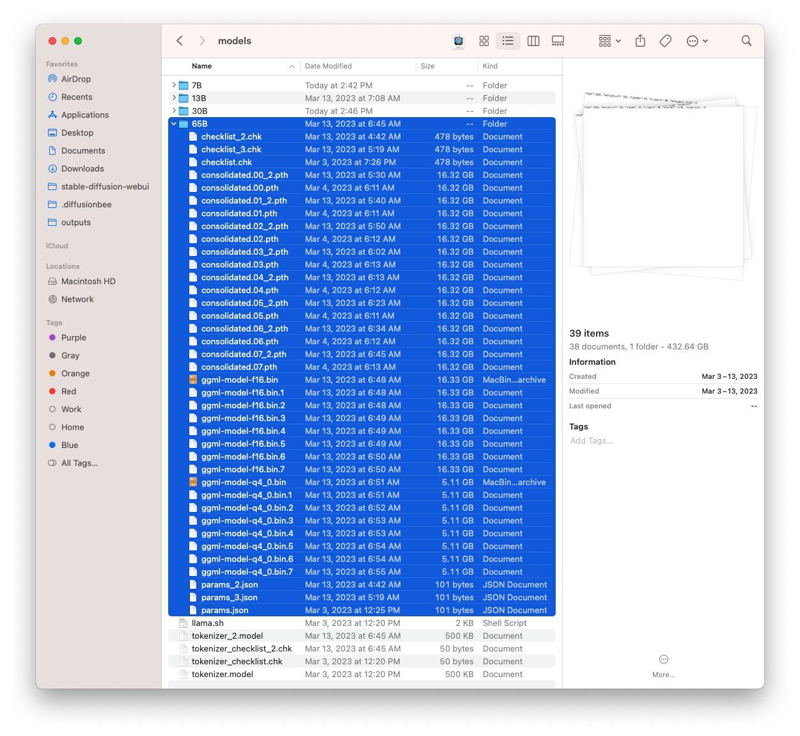
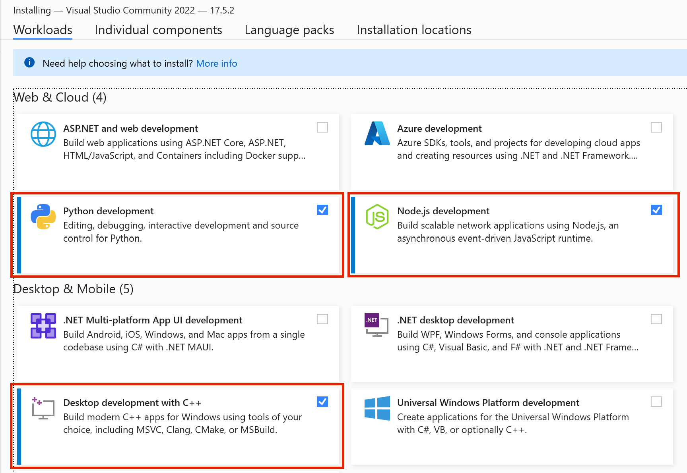

# Dalai

Run LLaMA and Alpaca on your computer.

<a href="https://github.com/cocktailpeanut/dalai" class='inverse btn'><i class="fa-brands fa-github"></i> GitHub</a>
<a href="https://twitter.com/cocktailpeanut" class='inverse btn'><i class="fa-brands fa-twitter"></i> Twitter</a>
<a href="https://discord.gg/WWfgrzzkCT" class='inverse btn'><i class="fa-brands fa-discord"></i> Discord</a>

---

## JUST RUN THIS



## TO GET

Both alpaca and llama working on your computer!


---

1. Powered by [llama.cpp](https://github.com/ggerganov/llama.cpp), [llama-dl CDN](https://github.com/shawwn/llama-dl), and [alpaca.cpp](https://github.com/antimatter15/alpaca.cpp)
2. Hackable web app included
3. Ships with JavaScript API
4. Ships with [Socket.io](https://socket.io/) API

---

# Intro

## 1. Cross platform

Dalai runs on all of the following operating systems:

1. Linux
2. Mac
3. Windows

## 2. Memory Requirements

Runs on most modern computers. Unless your computer is very very old, it should work.

According to [a llama.cpp discussion thread](https://github.com/ggerganov/llama.cpp/issues/13), here are the memory requirements:

- 7B => ~4 GB
- 13B => ~8 GB
- 30B => ~16 GB
- 65B => ~32 GB

## 3. Disk Space Requirements

### Alpaca

Currently 7B and 13B models are available via [alpaca.cpp](https://github.com/antimatter15/alpaca.cpp)

#### 7B

Alpaca comes fully quantized (compressed), and the only space you need for the 7B model is 4.21GB:



#### 13B

Alpaca comes fully quantized (compressed), and the only space you need for the 13B model is 8.14GB:




### LLaMA

You need a lot of space for storing the models. **The model name must be one of: 7B, 13B, 30B, and 65B.**

You do NOT have to install all models, you can install one by one. Let's take a look at how much space each model takes up:

> NOTE
>
> The following numbers assume that you DO NOT touch the original model files and keep BOTH the original model files AND the quantized versions.
>
> You can optimize this if you delete the original models (which are much larger) after installation and keep only the quantized versions.

#### 7B

- Full: The model takes up 31.17GB
- Quantized: 4.21GB



#### 13B

- Full: The model takes up 60.21GB
- Quantized: 4.07GB * 2 = 8.14GB



#### 30B

- Full: The model takes up 150.48GB
- Quantized: 5.09GB * 4 = 20.36GB



#### 65B

- Full: The model takes up 432.64GB
- Quantized: 5.11GB * 8 = 40.88GB



---

# Quickstart

## Docker compose

Requires that you have docker installed and running.
```
docker compose build
docker compose run dalai npx dalai alpaca install 7B # or a different model
docker compose up -d
```

This will dave the models in the `./models` folder

View the site at http://127.0.0.1:3000/

## Mac

### Step 1. Install node.js >= 18

If your mac doesn't have node.js installed yet, make sure to install node.js >= 18

<a href="https://nodejs.org/en/download/" class='btn'>Install Node.js</a>


### Step 2.1. Install models

Currently supported engines are `llama` and `alpaca`.

#### Add alpaca models

To download alpaca models, you can run:

```
npx dalai alpaca install 7B
```


#### Add llama models

To download llama models, you can run:

```
npx dalai llama install 7B
```


or to download multiple models:

```
npx dalai llama install 7B 13B
```

Now go to step 3.

### Step 2.2. Troubleshoot

Normally you don't need this step, but if running the commands above don't do anything and immediately end, it means something went wrong because some of the required modules are not installed on your system.

In that case, try the following steps:

#### 1. Install homebrew

In case homebrew is not installed on your computer, install it by running:

```
/bin/bash -c "$(curl -fsSL https://raw.githubusercontent.com/Homebrew/install/HEAD/install.sh)"
```

> Or you can find the same instruction on the homebrew hompage: https://brew.sh/

#### 2. Install dependencies

Once homebrew is installed, install these dependencies:

```
brew install cmake
brew install pkg-config
```

#### 3. Update NPM

Just to make sure we cover every vector, let's update NPM as well:

```
npm install -g npm@latest
```

Now go back to step 2.1 and try running the `npx dalai` commands again.

### Step 3. Run Web UI

After everything has been installed, run the following command to launch the web UI server:

```
npx dalai serve
```

and open http://localhost:3000 in your browser. Have fun!

---

## Windows

### Step 1. Install Visual Studio

On windows, you need to install Visual Studio before installing Dalai.

Press the button below to visit the Visual Studio downloads page and download:

<a href="https://visualstudio.microsoft.com/downloads/" class='btn'>Download Microsoft Visual Studio</a>

**IMPORTANT!!!**

When installing Visual Studio, make sure to check the 3 options as highlighted below:

1. Python development
2. Node.js development
3. Desktop development with C++



---

### Step 2.1. Install models

> **IMPORTANT**
>
> On Windows, make sure to run all commands in **cmd**.
>
> DO NOT run in **powershell**. Powershell has unnecessarily strict permissions and makes the script fail silently.

Currently supported engines are `llama` and `alpaca`.

#### Install alpaca

To download alpaca models. Open your `cmd` application and enter:

```
npx dalai alpaca install 7B
```


#### Add llama models

To download llama models. Open your `cmd` application and enter:

```
npx dalai llama install 7B
```


or to download multiple models:

```
npx dalai llama install 7B 13B
```

---

### Step 2.2. Troubleshoot (optional)

In case above steps fail, try installing Node.js and Python separately.

Install Python:

<a href="https://www.python.org/ftp/python/3.10.10/python-3.10.10-embed-amd64.zip" class='btn'>Download Python</a>

Install Node.js >= 18:

<a href="https://nodejs.org/en/download/" class='btn'>Download Node.js</a>

After both have been installed, open powershell and type `python` to see if the application exists. And also type `node` to see if the application exists as well.

Once you've checked that they both exist, try again.


### Step 3. Run Web UI

After everything has been installed, run the following command to launch the web UI server (Make sure to run in `cmd` and not powershell!):

```
npx dalai serve
```

and open http://localhost:3000 in your browser. Have fun!

---


## Linux

### Step 1. Install Dependencies

You need to make sure you have the correct version of Python and Node.js installed.

#### Step 1.1. Python <= 3.10

<a href="https://pimylifeup.com/installing-python-on-linux/" class='btn'>Download Python</a>

> Make sure the version is 3.10 or lower (not 3.11)
Python must be 3.10 or below (pytorch and other libraries are not supported yet on the latest)


#### Step 1.2. Node.js >= 18

<a href="https://nodejs.org/en/download/package-manager/" class='btn'>Download node.js</a>

> Make sure the version is 18 or higher


---

### Step 2.1. Install models

Currently supported engines are `llama` and `alpaca`.

#### Add alpaca models

To download alpaca models, you can run:

```
npx dalai alpaca install 7B
```


#### Add llama models

To download llama models, you can run:

```
npx dalai llama install 7B
```


or to download multiple models:

```
npx dalai llama install 7B 13B
```

### Step 2.2. Troubleshoot

In case the model install silently fails or hangs forever, try the following command, and try running the npx command again:

On ubuntu/debian/etc.:

```
sudo apt-get install build-essential python3-venv -y
```

On fedora/etc.:

```
dnf install make automake gcc gcc-c++ kernel-devel python3-virtualenv -y
```


### Step 3. Run Web UI

After everything has been installed, run the following command to launch the web UI server:

```
npx dalai serve
```

and open http://localhost:3000 in your browser. Have fun!


---


# API

Dalai is also an NPM package:

1. programmatically install
2. locally make requests to the model
3. run a dalai server (powered by socket.io)
3. programmatically make requests to a remote dalai server (via socket.io)

Dalai is an NPM package. You can install it using:

```
npm install dalai
```

---

## 1. constructor()

### Syntax

```javascript
const dalai = new Dalai(home)
```

- `home`: (optional) manually specify the [llama.cpp](https://github.com/ggerganov/llama.cpp) folder

By default, Dalai automatically stores the entire `llama.cpp` repository under `~/llama.cpp`.

However, often you may already have a `llama.cpp` repository somewhere else on your machine and want to just use that folder. In this case you can pass in the `home` attribute.

### Examples

#### Basic

Creates a workspace  at `~/llama.cpp`

```javascript
const dalai = new Dalai()
```

#### Custom path

Manually set the `llama.cpp` path:


```javascript
const dalai = new Dalai("/Documents/llama.cpp")
```

---

## 2. request()

### Syntax

```javascript
dalai.request(req, callback)
```

- `req`: a request object. made up of the following attributes:
  - `prompt`: **(required)** The prompt string
  - `model`: **(required)** The model type + model name to query. Takes the following form: `<model_type>.<model_name>`
    - Example: `alpaca.7B`, `llama.13B`, ...
  - `url`: only needed if connecting to a remote dalai server
    - if unspecified, it uses the node.js API to directly run dalai locally
    - if specified (for example `ws://localhost:3000`) it looks for a socket.io endpoint at the URL and connects to it.
  - `threads`: The number of threads to use (The default is 8 if unspecified)
  - `n_predict`: The number of tokens to return (The default is 128 if unspecified)
  - `seed`: The seed. The default is -1 (none)
  - `top_k`
  - `top_p`
  - `repeat_last_n`
  - `repeat_penalty`
  - `temp`: temperature
  - `batch_size`: batch size
  - `skip_end`: by default, every session ends with `\n\n<end>`, which can be used as a marker to know when the full response has returned. However sometimes you may not want this suffix. Set `skip_end: true` and the response will no longer end with `\n\n<end>`
- `callback`: the streaming callback function that gets called every time the client gets any token response back from the model

### Examples

#### 1. Node.js

Using node.js, you just need to initialize a Dalai object with `new Dalai()` and then use it.

```javascript
const Dalai = require('dalai')
new Dalai().request({
  model: "7B",
  prompt: "The following is a conversation between a boy and a girl:",
}, (token) => {
  process.stdout.write(token)
})
```

#### 2. Non node.js (socket.io)

To make use of this in a browser or any other language, you can use thie socket.io API.

##### Step 1. start a server

First you need to run a Dalai socket server:

```javascript
// server.js
const Dalai = require('dalai')
new Dalai().serve(3000)     // port 3000
```

##### Step 2. connect to the server

Then once the server is running, simply make requests to it by passing the `ws://localhost:3000` socket url when initializing the Dalai object:

```javascript
const Dalai = require("dalai")
new Dalai().request({
  url: "ws://localhost:3000",
  model: "7B",
  prompt: "The following is a conversation between a boy and a girl:",
}, (token) => {
  console.log("token", token)
})
```

---

## 3. serve()

### Syntax

Starts a socket.io server at `port`

```javascript
dalai.serve(port)
```

### Examples

```javascript
const Dalai = require("dalai")
new Dalai().serve(3000)
```

---

## 4. http()

### Syntax

connect with an existing `http` instance (The `http` npm package)

```javascript
dalai.http(http)
```

- `http`: The [http](https://nodejs.org/api/http.html) object

### Examples

This is useful when you're trying to plug dalai into an existing node.js web app

```javascript
const app = require('express')();
const http = require('http').Server(app);
dalai.http(http)
http.listen(3000, () => {
  console.log("server started")
})
```

## 5. install()

### Syntax

```javascript
await dalai.install(model_type, model_name1, model_name2, ...)
```

- `model_type`: the name of the model. currently supports:
  - "alpaca"
  - "llama"
- `model1`, `model2`, ...: the model names to install ("7B"`, "13B", "30B", "65B", etc)

### Examples

Install Llama "7B" and "13B" models:


```javascript
const Dalai = require("dalai");
const dalai = new Dalai()
await dalai.install("llama", "7B", "13B")
```

Install alpaca 7B model:

```javascript
const Dalai = require("dalai");
const dalai = new Dalai()
await dalai.install("alpaca", "7B")
```

---

## 6. installed()

returns the array of installed models

### Syntax

```javascript
const models = await dalai.installed()
```

### Examples


```javascript
const Dalai = require("dalai");
const dalai = new Dalai()
const models = await dalai.installed()
console.log(models)     // prints ["7B", "13B"]
```

<!--

---

## 7. download()

Download models.

There are two download options:

1. **LLaMA:** Download the original LLaMA model, convert it, and quantize (compress) it
2. **LLaMA.zip:** Download the compressed version (generated from step 1 and published on HuggingFace)

### Syntax

```javascript
await dalai.download(model1, model2, model3, ...)
```

- `models`: the model names to install. Can be: "7B"`, "13B", "30B", "65B", "7B.zip", "13B.zip", "30B.zip", "65B.zip"
  - "7B", "13B", "30B", "65B": download the raw model, convert, and quantize
  - "7B.zip", "13B.zip", "30B.zip", "65B.zip": download the quantized model (no need to waste time downloading huge files)

### Examples

Install the "7B" and "13B" models:


```javascript
const Dalai = require("dalai");
const dalai = new Dalai()
await dalai.install("7B", "13B")
```

-->

---


# FAQ

## Using a different home folder

By default Dalai uses your home directory to store the entire repository (`~/dalai`). However sometimes you may want to store the archive elsewhere.

In this case you can call all CLI methods using the `--home` flag:

### 1. Installing models to a custom path

```
npx dalai llama install 7B --home ~/test_dir
```

### 2. Serving from the custom path

```
npx dalai serve --home ~/test_dir
```


## Updating to the latest

To make sure you update to the latest, first find the latest version at https://www.npmjs.com/package/dalai

Let's say the latest version is `0.3.0`. To update the dalai version, run:

```
npx dalai@0.3.0 setup
```


## Staying up to date

Have questions or feedback? Follow the project through the following outlets:

<a href="https://github.com/cocktailpeanut/dalai" class='inverse btn'><i class="fa-brands fa-github"></i> GitHub</a>
<a href="https://twitter.com/cocktailpeanut" class='inverse btn'><i class="fa-brands fa-twitter"></i> Twitter</a>
<a href="https://discord.gg/WWfgrzzkCT" class='inverse btn'><i class="fa-brands fa-discord"></i> Discord</a>


---
