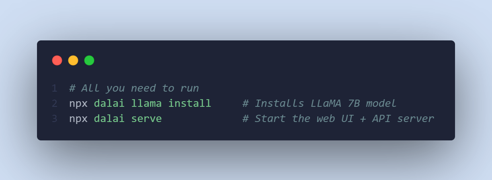
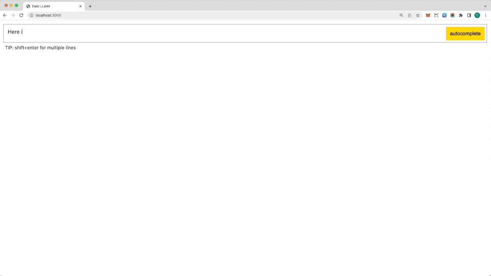

# Dalai with ChatGPT UI

Run LLaMA on your computer.

<a href="https://github.com/cocktailpeanut/dalai" class='inverse btn'><i class="fa-brands fa-github"></i> Github</a>
<a href="https://twitter.com/cocktailpeanut" class='inverse btn'><i class="fa-brands fa-twitter"></i> Twitter</a>
<a href="https://discord.gg/XahBUrbVwz" class='inverse btn'><i class="fa-brands fa-discord"></i> Discord</a>

---

## Table of Contents
- [Intro](https://github.com/ItsPi3141/dalai#intro)
  - [Cross platform](https://github.com/ItsPi3141/dalai#1-cross-platform)
  - [System requirements](https://github.com/ItsPi3141/dalai#2-system-requirements)
  - [Disk space requirements](https://github.com/ItsPi3141/dalai#3-disk-space-requirements)
    - [7B model](https://github.com/ItsPi3141/dalai#7b)
    - [13B model](https://github.com/ItsPi3141/dalai#13b)
    - [30B model](https://github.com/ItsPi3141/dalai#30b)
    - [65B model](https://github.com/ItsPi3141/dalai#65b)
- [**Quickstart**](https://github.com/ItsPi3141/dalai#65b)
  - [MacOS](https://github.com/ItsPi3141/dalai#mac)
  - [Windows](https://github.com/ItsPi3141/dalai#windows)
  - [Linux](https://github.com/ItsPi3141/dalai#linux)
- [API](https://github.com/ItsPi3141/dalai#api)
  - [constructor()](https://github.com/ItsPi3141/dalai#1-constructor)
  - [request()](https://github.com/ItsPi3141/dalai#2-request)
  - [serve()](https://github.com/ItsPi3141/dalai#3-serve)
  - [http()](https://github.com/ItsPi3141/dalai#4-http)
  - [install()](https://github.com/ItsPi3141/dalai#5-install)
  - [installed()](https://github.com/ItsPi3141/dalai#6-installed)
- [FAQ](https://github.com/ItsPi3141/dalai#faq)
  - [Updating to latest](https://github.com/ItsPi3141/dalai#updating-to-the-latest)
  - [Staying up to date](https://github.com/ItsPi3141/dalai#staying-up-to-date)

#### JUST RUN THIS:



#### TO GET:



---

1. Powered by [llama.cpp](https://github.com/ggerganov/llama.cpp) and [llama-dl CDN](https://github.com/shawwn/llama-dl)
2. Hackable web app included
3. Ships with JavaScript API
4. Ships with [Socket.io](https://socket.io/) API

---

# Intro

## 1. Cross platform

Dalai runs on all of the following operating systems:

1. Linux
2. Mac
3. Windows

## 2. System Requirements

Runs on most modern computers. Unless your computer is very very old, it should work.

## 3. Disk Space Requirements

You need a lot of space for storing the models.

You do NOT have to install all models, you can install one by one. Let's take a look at how much space each model takes up:

> NOTE
>
> The following numbers assume that you DO NOT touch the original model files and keep BOTH the original model files AND the quantized versions.
>
> You can optimize this if you delete the original models (which are much larger) after installation and keep only the quantized versions.

### 7B

- Full: The model takes up 31.17GB
- Quantized: 4.21GB


### 13B

- Full: The model takes up 60.21GB
- Quantized: 4.07GB * 2 = 8.14GB


### 30B

- Full: The model takes up 150.48GB
- Quantized: 5.09GB * 4 = 20.36GB


### 65B

- Full: The model takes up 432.64GB
- Quantized: 5.11GB * 8 = 40.88GB


---

# Quickstart

## Mac

### Step 1. Install node.js

<a href="https://nodejs.org/en/download/" class='btn'>Install Node.js</a>

### Step 2. Install Dalai

Basic install (7B model only)

```
npx dalai llama
```

Or, install all models

```
npx dalai llama 7B 13B 30B 65B
```

The install command :

1. Creates a folder named `dalai` under your home directory (`~`)
2. Installs and builds the [llama.cpp](https://github.com/ggerganov/llama.cpp) project under `~/llama.cpp`
3. Downloads all the requested models from the [llama-dl CDN](https://github.com/shawwn/llama-dl) to `~/llama.cpp/models`
4. Runs some tasks to convert the LLaMA models so they can be used

### Step 3. Run Web UI
```
npm start
```

After everything has been installed, open http://localhost:3000 in your browser. Have fun!


## Windows

### Step 1. Install Visual Studio

On windows, you need to install Visual Studio before installing Dalai.

Press the button below to visit the Visual Studio downloads page and download:

<a href="https://visualstudio.microsoft.com/downloads/" class='btn'>Download Microsoft Visual Studio</a>

---

**IMPORTANT!!!**

When installing Visual Studio, make sure to check the 3 options as highlighted below:

1. Python development
2. Node.js development
3. Desktop development with C++


### Step 2. Install Dalai

Basic install (7B model only)

```
npx dalai llama
```

Or, install all models

```
npx dalai llama 7B 13B 30B 65B
```

The install command :

1. Creates a folder named `dalai` under your Documents folder directory (`D:\Documents`). If folder doesn't exist, it will go to your home folder (`%USERPROFILE%`)
2. Installs and builds the [llama.cpp](https://github.com/ggerganov/llama.cpp) project under `~/llama.cpp`
3. Downloads all the requested models from the [llama-dl CDN](https://github.com/shawwn/llama-dl) to `~/llama.cpp/models`
4. Runs some tasks to convert the LLaMA models so they can be used

### Step 3. Run Web UI
```
npm start
```

After everything has been installed, open http://localhost:3000 in your browser. Have fun!

## Linux

### Step 1. Install

Basic install (7B model only)

```
npx dalai llama
```

Or, install all models

```
npx dalai llama 7B 13B 30B 65B
```

The install command :

1. Creates a folder named `dalai` under your home directory (`~`)
2. Installs and builds the [llama.cpp](https://github.com/ggerganov/llama.cpp) project under `~/llama.cpp`
3. Downloads all the requested models from the [llama-dl CDN](https://github.com/shawwn/llama-dl) to `~/llama.cpp/models`
4. Runs some tasks to convert the LLaMA models so they can be used

### Step 2. Run Web UI
```
npm start
```

After everything has been installed, open http://localhost:3000 in your browser. Have fun!

---

# API

Dalai is also an NPM package:

1. programmatically install
2. locally make requests to the model
3. run a dalai server (powered by socket.io)
3. programmatically make requests to a remote dalai server (via socket.io)

Dalai is an NPM package. You can install it using:

```
npm install dalai
```

---

## 1. constructor()

### Syntax

```javascript
const dalai = new Dalai(home)
```

- `home`: (optional) manually specify the [llama.cpp](https://github.com/ggerganov/llama.cpp) folder

By default, Dalai automatically stores the entire `llama.cpp` repository under `~/llama.cpp`.

However, often you may already have a `llama.cpp` repository somewhere else on your machine and want to just use that folder. In this case you can pass in the `home` attribute.

### Examples

#### Basic

Creates a workspace  at `~/llama.cpp` 

```javascript
const dalai = new Dalai()
```

#### Custom path

Manually set the `llama.cpp` path:


```javascript
const dalai = new Dalai("/Documents/llama.cpp")
```

---

## 2. request()

### Syntax

```javascript
dalai.request(req, callback)
```

- `req`: a request object. made up of the following attributes:
  - `prompt`: **(required)** The prompt string
  - `model`: **(required)** The model name to query ("7B", "13B", etc.)
  - `url`: only needed if connecting to a remote dalai server
    - if unspecified, it uses the node.js API to directly run dalai locally
    - if specified (for example `ws://localhost:3000`) it looks for a socket.io endpoint at the URL and connects to it.
  - `threads`: The number of threads to use (The default is 8 if unspecified)
  - `n_predict`: The number of tokens to return (The default is 128 if unspecified)
  - `seed`: The seed. The default is -1 (none)
  - `top_k`
  - `top_p`
  - `repeat_last_n`
  - `repeat_penalty`
  - `temp`: temperature
  - `batch_size`: batch size
  - `skip_end`: by default, every session ends with `\n\n<end>`, which can be used as a marker to know when the full response has returned. However sometimes you may not want this suffix. Set `skip_end: true` and the response will no longer end with `\n\n<end>`
- `callback`: the streaming callback function that gets called every time the client gets any token response back from the model

### Examples

#### 1. Node.js

Using node.js, you just need to initialize a Dalai object with `new Dalai()` and then use it.

```javascript
const Dalai = require('dalai')
new Dalai().request({
  model: "7B",
  prompt: "The following is a conversation between a boy and a girl:",
}, (token) => {
  process.stdout.write(token)
})
```

#### 2. Non node.js (socket.io)

To make use of this in a browser or any other language, you can use thie socket.io API.

##### Step 1. start a server

First you need to run a Dalai socket server:

```javascript
// server.js
const Dalai = require('dalai')
new Dalai().serve(3000)     // port 3000
```

##### Step 2. connect to the server

Then once the server is running, simply make requests to it by passing the `ws://localhost:3000` socket url when initializing the Dalai object:

```javascript
const Dalai = require("dalai")
new Dalai().request({
  url: "ws://localhost:3000",
  model: "7B",
  prompt: "The following is a conversation between a boy and a girl:",
}, (token) => {
  console.log("token", token)
})
```

---

## 3. serve()

### Syntax

Starts a socket.io server at `port`

```javascript
dalai.serve(port)
```

### Examples

```javascript
const Dalai = require("dalai")
new Dalai().serve(3000)
```

---

## 4. http()

### Syntax

connect with an existing `http` instance (The `http` npm package)

```javascript
dalai.http(http)
```

- `http`: The [http](https://nodejs.org/api/http.html) object

### Examples

This is useful when you're trying to plug dalai into an existing node.js web app

```javascript
const app = require('express')();
const http = require('http').Server(app);
dalai.http(http)
http.listen(3000, () => {
  console.log("server started")
})
```

## 5. install()

### Syntax

```javascript
await dalai.install(model1, model2, ...)
```

- `models`: the model names to install ("7B"`, "13B", "30B", "65B", etc)

### Examples

Install the "7B" and "13B" models:


```javascript
const Dalai = require("dalai");
const dalai = new Dalai()
await dalai.install("7B", "13B")
```

---

## 6. installed()

returns the array of installed models

### Syntax

```javascript
const models = await dalai.installed()
```

### Examples


```javascript
const Dalai = require("dalai");
const dalai = new Dalai()
const models = await dalai.installed()
console.log(models)     // prints ["7B", "13B"]
```

---

# FAQ

## Updating to the latest

Dalai is a young project and will evolve quickly.

To update dalai, you will need to run the dalai command with a version number specified (You only need to do this once when you update).

For example, let's say you've been using `dalai@0.1.0` but a new version `dalai@0.2.0` came out.

The simplest way to update is to just run the dalai server:

```
npx dalai@0.2.0 serve
```

Once you run the command it will ask you if you want to update. Confirm, and it will now install `0.2.0`, and from that point on you don't need to specify the version. You can just run `npx dalai serve` and the new version will be executed from that point on.


## Staying up to date

Have questions or feedback? Follow the project through the following outlets:

<a href="https://github.com/cocktailpeanut/dalai" class='inverse btn'><i class="fa-brands fa-github"></i> Github</a>
<a href="https://twitter.com/cocktailpeanut" class='inverse btn'><i class="fa-brands fa-twitter"></i> Twitter</a>
<a href="https://discord.gg/XahBUrbVwz" class='inverse btn'><i class="fa-brands fa-discord"></i> Discord</a>


---
